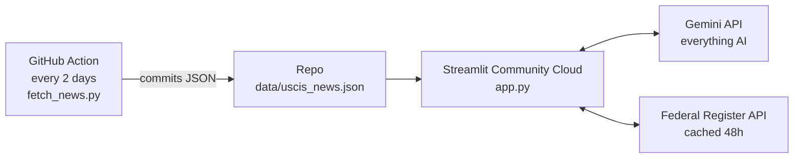

<!--
  README.md
-->

<p align="center">
  <!-- BADGES:START -->
  <a href="#"></a>
  <a href="#"></a>
  <a href="#"></a>
  <a href="#"></a>
  <a href="#"></a>
  <!-- BADGES:END -->
</p>

# Immigration Co-Pilot

Author: Saina Kakkar
Built for the **Build with Gemini XPRIZE** (XPRIZE Foundation + Google)

### Project Description
Immigration Co-Pilot is a free web tool for immigrant families who are trying
to understand the US immigration system. I built it for people who cannot
afford an attorney and need plain-language answers about what is happening in
their case and what to do next, in their own language.

The numbers that made me build this:

- Only about 30% of immigrants with pending court cases have a lawyer ([TRAC](https://tracreports.org/reports/736/))
- 62% of people without a lawyer are ordered deported, compared to 27% with one ([American Immigration Council](https://www.americanimmigrationcouncil.org/report/access-counsel-immigration-court/))
- Almost all AI immigration tooling today is sold to attorneys. This tool is for the families themselves.

## Table of Contents

* [Key Features](#key-features)
* [How Gemini Is Used](#how-gemini-is-used)
* [Architecture](#architecture)
* [Problems I Ran Into](#problems-i-ran-into)
* [Running Locally](#running-locally)
* [Live Demo](#live-demo)
* [Privacy & Safety](#privacy--safety)
* [Disclaimer](#disclaimer)

## Key Features

| Feature | How it works |
|---|---|
| **Decode a Letter** | You photograph any USCIS/ICE/State Dept notice (RFE, NOID, receipt, denial). Gemini reads the photo directly, pulls out the notice type, case number, and every deadline, explains it at a 5th-grade reading level, and gives you a calendar (.ics) file with reminders. |
| **News** | Real headlines from USCIS, the White House, the State Department, and the Federal Register. A GitHub Action fetches them every 2 days and Gemini explains each one in plain language. When the feeds are quiet, Gemini searches the live web with Google Search grounding and cites what it finds. |
| **Your Situation** | You describe your case, optionally attach a document (PDF or photo), and get an honest assessment: issues, urgency, actions, deadlines, and official resources. |
| **OPT Deadlines** | Every OPT / STEM OPT deadline is computed in code from USCIS rules. The AI explains the dates but it never invents them. Includes calendar download. |
| **Green Card Checklist** | Case-specific forms, fees, document checklist, red flags, timeline, and a ready-to-edit cover letter. You can download it to share with family or an attorney. |
| **12 languages** | The whole interface and every answer is available in English, Spanish, Chinese, Hindi, Tagalog, Vietnamese, Korean, Portuguese, Arabic, Haitian Creole, Russian, and French. Gemini translates once per language and the result is cached. |

## How Gemini Is Used

Here is the list of Gemini capabilities I utilized:

- **Multimodal document understanding.** PDFs and phone photos of government
  letters are read natively with `Part.from_bytes`. I did not have to build
  any OCR pipeline for this.
- **Google Search grounding.** Policy news comes from live, cited searches
  instead of training-data guesses.
- **Structured JSON output.** Every feature receives typed, render-ready
  responses, so the UI code never parses free text.
- **Interface translation.** One cached Gemini call per language.

Model: `gemini-2.5-flash` via the `google-genai` SDK.

## Architecture



The unusual part is on the left. The app does not fetch government RSS feeds
itself. A scheduled GitHub Action fetches them and commits the JSON into the
repo, and the app only reads that file. The next section explains why.

## Problems I Ran Into

This project looked simple on paper. These are the real problems I had to
debug, in case they help someone building something similar:

1. **Government websites block cloud providers.** When the app ran on
   Streamlit Cloud, requests to USCIS and other .gov sites came back empty or
   blocked, because those sites reject traffic from data center IP ranges.
   The same code worked fine on my laptop, which made it confusing to debug.
   The fix was to fetch RSS on GitHub's runners (which are not blocked) and
   commit the results to the repo. The Federal Register API is the exception,
   it allows direct calls, so the app calls it live and caches for 48 hours.

2. **4 of the 5 RSS feed URLs were dead.** The feed URLs I found in
   documentation returned 404 because the agencies had moved them. For
   example, the White House feed is now `whitehouse.gov/news/feed/` and the
   old DHS feed is gone completely. I had to find each new URL by hand.

3. **A substring bug hid STEM OPT news.** My first filter checked
   `"stem" in title.lower()`, which also matched the word "Systems". News
   about computer systems was showing up under STEM OPT. Now the filter
   matches whole words only.

4. **Old feed entries looked like breaking news.** Some government feeds
   still contain entries from around a decade ago. Without a date cutoff, the
   news tab showed announcements from a different administration as if they
   were current. I added a recency filter.

5. **Slow first loads.** A cold start could hang while waiting on Gemini. I
   added a 30-second timeout on the client and made the slowest call (live
   grounded search) run only when there is no cached news at all, instead of
   on every load.

## Running Locally

1. **Clone the repo:**

   ```bash
   git clone https://github.com/sainakakkar2006/immigration-copilot.git
   cd immigration-copilot
   ```

2. **Install dependencies:**

   ```bash
   pip install -r requirements.txt
   ```

3. **Add your Gemini key and run:**

   ```bash
   export GEMINI_API_KEY=your-key   # from aistudio.google.com
   streamlit run app.py
   ```

## Live Demo

Prefer not to run locally? Check out the deployed app here:
[Immigration Co-Pilot on Streamlit](https://immigration-copilot-adazqhaecrqc8g7dujpe7h.streamlit.app/)

Project site: [sainakakkar2006.github.io/immigration-copilot](https://sainakakkar2006.github.io/immigration-copilot/)

## Privacy & Safety

- Uploaded documents are processed in memory and never stored.
- No accounts, no tracking, and no immigration-status data is retained.
- Every page carries a "not legal advice" notice with a one-tap link to free
  legal aid ([immigrationlawhelp.org](https://www.immigrationlawhelp.org)).
- Deadline math is computed in code, never generated by AI. I decided this
  early: a wrong explanation is bad, but a wrong deadline can cost someone
  their status. Could've let Gemini generate the OPT dates like everything
  else, but dates are exactly where a hallucination hurts the most.

## Disclaimer

This is not a law firm and does not give legal advice. If your case involves
prior violations, criminal history, or deportation proceedings, please
consult a licensed immigration attorney.
